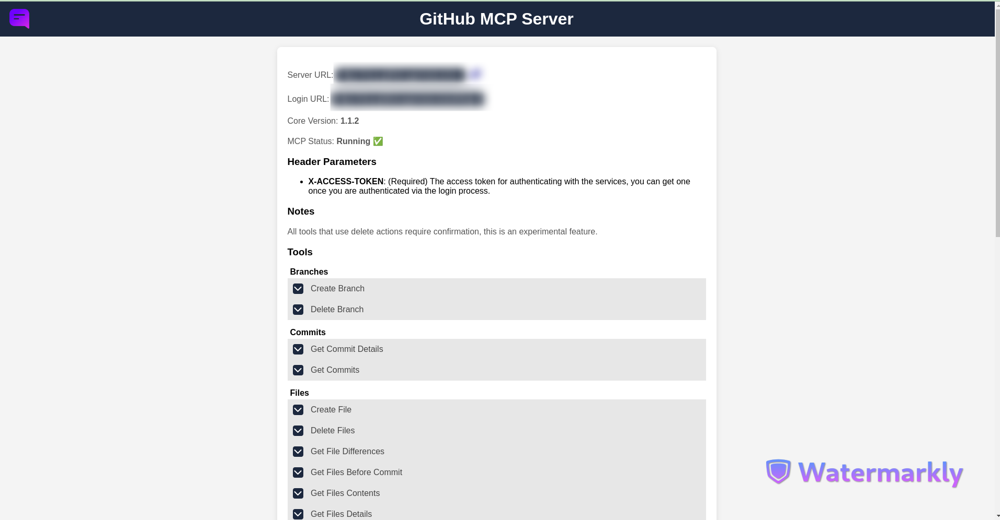

# Easy MCP GitHub Tools Application

This is a set of tools for github to be used with easy mcp server.<br>
https://github.com/ground-creative/easy-mcp-python

## Key Features

- **Branch Management**: Easily create and delete branches in your GitHub repositories.
- **Issue Tracking**: Create, update, and delete issues, as well as manage comments on issues.
- **Commit History**: Fetch detailed commit information and commit history for any branch in your repository.
- **File Management**: Create, update, and delete files within your GitHub repositories, including fetching file contents and differences.
- **Pull Requests**: Create and manage pull requests, including merging them into target branches.
- **Global Search**: Perform global searches across GitHub for repositories, issues, and code.
- **Release Management**: Retrieve and manage releases within your GitHub repositories.
- **OAuth Authentication**: Securely authenticate users using GitHub's OAuth service.

## Authentication

This application uses GitHub oAuth service to authenticate the user.<br>
To use this app, you must create an OAuth application on GitHub.

How To Authenticate:

1. Go to auth/login and authenticate

2. Use the paramater X-ACCESS-TOKEN with the request headers when making calls to the server.

## Create GitHub Application Instructions

To use this app, you must first create an OAuth application on GitHub. Follow these steps:

1. Go to your GitHub account settings.
2. Navigate to **Developer settings** > **OAuth Apps**.
3. Click on **New OAuth App**.
4. Fill in the required fields:
   - **Application Name**: Choose a name for your application.
   - **Homepage URL**: Enter the main URL of your application (ex: `https://mcp.yourdomain.com`).
   - **Authorization callback URL**: Set this to `http://{Your Host}:{Your Port}/auth/callback`.
5. After creating the application, you will receive a **Client ID** and **Client Secret**. Keep these credentials safe, as you will need them to add them to the `client_credentials.json` file.

## Installation

1. Clone the repository from the root folder of the easy mcp installation:

```
git clone https://github.com/ground-creative/easy-mcp-github-tools-python.git app
```

2. Install requirements:

```
pip install -r app/requirements.txt
```

3. Generate encryption key:

```
python -c "from cryptography.fernet import Fernet; print(Fernet.generate_key().decode())"
```

4. Add parameters to env file:

```
APP_HOST=Application Host ex: `https://mcp.yourdomain.com`
DB_PATH=storage/sqlite_credentials.db
CYPHER=Your Encryption Key Here

# Optional
SITE_URL=Main Application Site URL
SITE_NAME=MAin Application Site Name
```

5. Create json file `client_credentials.json` with GitHub oauth credentials in storage folder:

```
# Follow instructions of section "Create GitHub Application instructions" to create credentials

{
    "client_id": "XXXXX",
    "client_secret": "XXXXXXX"
}
```

6. Run the server:

```
# Run via fastapi wrapper
python3 run.py -s fastapi
```
## Available MCP Tools

The following tools are provided by this MCP server:

| Tool Name                 | Description                                                                                  | Parameters Required                                                                                                                                                                                                                                                            |
| ------------------------- | -------------------------------------------------------------------------------------------- | ------------------------------------------------------------------------------------------------------------------------------------------------------------------------------------------------------------------------------------------------------------------------------ |
| Create Branch             | Creates a new branch in a specified GitHub repository based on an existing branch.           | new_branch (str), base_branch (Optional[str]), repo (str)                                                                                                                                                                                                                     |
| Delete Branch             | Deletes a specified branch in a GitHub repository.                                           | branch (str), repo (str), confirmation_token (Optional[str])                                                                                                                                                                                                                  |
| Delete Issue Comment      | Deletes a specified comment on an issue in a GitHub repository.                              | comment_id (int), repo (str), confirmation_token (Optional[str])                                                                                                                                                                                                            |
| Get Commit Details        | Fetch detailed information for a specific commit from a GitHub repository.                   | sha (str), repo (str)                                                                                                                                                                                                                                                        |
| Get Commits               | Fetch commit history from a GitHub repository.                                               | branch (Optional[str]), repo (str), path (Optional[str]), per_page (Optional[int]), since (Optional[str]), until (Optional[str])                                                                                                                                     |
| Create File               | Adds a new file to a specified GitHub repository on a specified branch.                      | file_path (str), content (str), repo (str), commit_message (Optional[str]), branch (Optional[str])                                                                                                                                                                   |
| Delete Files              | Deletes specified files in a GitHub repository from a specified branch.                      | file_paths (List[str]), repo (str), branch (Optional[str]), confirmation_token (Optional[str])                                                                                                                                                                       |
| Get File Differences      | Fetch file differences for a specific commit from a GitHub repository.                       | sha (str), files (List[str]), repo (str)                                                                                                                                                                                                                             |
| Get Files Before Commit   | Retrieve multiple content from multiple files before a given commit SHA.                     | sha (str), files (List[str]), repo (str)                                                                                                                                                                                                                             |
| Get Files Contents        | Fetch content for multiple files from a GitHub repository.                                   | file_paths (List[str]), repo (str), branch (Optional[str])                                                                                                                                                                                                           |
| Get Files Details         | Fetch details for multiple files from a GitHub repository without the content.               | files (List[str]), repo (str), branch (Optional[str])                                                                                                                                                                                                                |
| List Files                | Get a list of file paths from a GitHub repository using the git tree API.                    | folders (Optional[List[str]]), repo (str), branch (Optional[str])                                                                                                                                                                                                    |
| Search Files              | Search for a specific string in the files of a GitHub repository.                            | search_string (str), repo (str), folders (Optional[List[str]]), sort (Optional[str]), order (Optional[str]), page (Optional[int]), per_page (Optional[int])                                                                                                          |
| Global Search             | Perform a global search on GitHub based on the specified search type and query string.       | search_type (str), query (str), page (int), per_page (int)                                                                                                                                                                                                                     |
| Update File               | Update an existing file in a specified GitHub repository on a specified branch.              | file_path (str), new_content (str), repo (str), commit_message (Optional[str]), branch (Optional[str])                                                                                                                                                               |
| Create Issue Comment      | Adds a comment to a specified issue in a GitHub repository.                                  | issue_number (int), comment (str), repo (str)                                                                                                                                                                                                                        |
| Create Issue              | Create a new issue within a GitHub repository.                                               | title (str), body (Optional[str]), repo (str), labels (Optional[list])                                                                                                                                                                                               |
| Get Issue Comments        | Retrieve all messages (details and comments) of a specific issue within a GitHub repository. | issue_number (int), repo (str), page (Optional[int]), per_page (Optional[int]), sort (Optional[str]), order (Optional[str])                                                                                                                                          |
| Get Issue Details         | Retrieve the details of a specific issue within a GitHub repository.                         | issue_number (int), repo (str)                                                                                                                                                                                                                                       |
| Get Issues                | Fetch issues from a specified GitHub repository, allowing optional filters.                  | repo (str), state (Optional[str]), labels (Optional[str]), assignee (Optional[str]), milestone (Optional[str]), sort (Optional[str]), order (Optional[str]), per_page (Optional[int]), page (Optional[int])                                                          |
| Search Issues             | Search for issues in a specified GitHub repository, with optional filters.                   | repo (str), state (Optional[str]), labels (Optional[str]), assignee (Optional[str]), milestone (Optional[str]), sort (Optional[str]), order (Optional[str]), per_page (Optional[int]), page (Optional[int]), search_comments (Optional[bool]), query (Optional[str]) |
| Update Issue Comment      | Updates an existing comment on a specified issue in a GitHub repository.                     | comment_id (int), new_comment (str), repo (str)                                                                                                                                                                                                                      |
| Update Issue              | Updates an existing issue in a GitHub repository.                                            | issue_number (int), title (Optional[str]), body (Optional[str]), state (Optional[str]), labels (Optional[list]), repo (str)                                                                                                                                          |
| Create Pull Request       | Creates a pull request in a specified GitHub repository.                                     | target_branch (str), base_branch (Optional[str]), repo (str), title (Optional[str]), body (Optional[str])                                                                                                                                                            |
| Get Pull Request Details  | Fetch detailed information about a specific pull request from a GitHub repository.           | pull_number (int), repo (str)                                                                                                                                                                                                                                        |
| Get Pull Requests         | Fetch pull requests from a specified GitHub repository.                                      | repo (str), state (Optional[str]), sort (Optional[str]), order (Optional[str]), per_page (Optional[int]), page (Optional[int])                                                                                                                                       |
| Merge Pull Request        | Merge a specific pull request in a GitHub repository.                                        | pull_number (int), repo (str), commit_message (Optional[str])                                                                                                                                                                                                        |
| Create Repository         | Create a new repository on GitHub.                                                           | name (str), description (Optional[str]), private (Optional[bool]), auto_init (Optional[bool])                                                                                                                                                                                  |
| Delete Repository         | Deletes a specified GitHub repository.                                                       | repo (str), confirmation_token (Optional[str])                                                                                                                                                                                                                       |
| Find Repositories By Name | Search for repositories owned by a specific user that include the given query string.        | query (str), username (str)                                                                                                                                                                                                                                          |
| Get Releases              | Retrieve releases within a GitHub repository.                                                | per_page (Optional[int]), page (Optional[int]), repo (str), sort (Optional[str]), order (Optional[str])                                                                                                                                                              |
| Get Repositories          | Fetch all repositories for a specific GitHub user.                                           | username (str), type (Optional[str]), sort (Optional[str]), direction (Optional[str]), page (Optional[int]), per_page (Optional[int])                                                                                                                                |
| Get Repository Details    | Fetch details for a single repository from GitHub.                                           | repo (str)                                                                                                                                                                                                                                                           |
| Get Tags Or Branches      | List either tags or branches in a GitHub repository.                                         | type (str), repo (str), per_page (Optional[int]), page (Optional[int])                                                                                                                            |
# Server Info Page

The server info page with the tools specs URL is the {APP_HOST} parameter configured in the .env file.

# Screenshots

Server info page:


GitHub application oAuth page


User authenticated page

